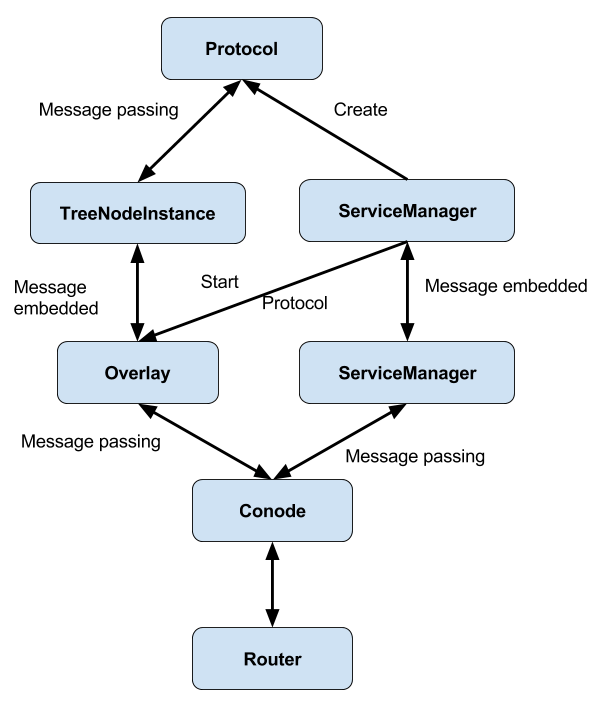

Navigation: [DEDIS](https://github.com/dedis/doc/tree/master/README.md) ::
[Onet](README.md) ::
Architecture

# Architecture

In ONet you define *Services* that use *Protocols* which can send and receive
messages. Each *Protocol* is instantiated when needed as a *ProtocolInstance*.
As multiple protocols can be run at the same time, there can be more than one
*ProtocolInstance* of the same Protocol. Onet makes sure all messages get
routed to the appropriate *ProtocolInstance*.

Outside applications can communicate with ONet over the service-API which is
implemented using protobuf over websockets, for JavaScript compatibility.

This page is to describe the high level view of the cothority framework. We'll
start first with a picture (because a picture is worth a thousand words :) and
then dive into each main components of the library.

As you can see there's a bunch of different entities involved. Let's get down
the rabbit hole to explain the most important ones...

## Network stack

The network stack is comprised of the Router which handles all incoming and
outgoing messages from/to the network. A Router can use different underlying
type of connections: TCP which uses regular TCP connections, Local which uses
channels and is mainly for testing purposes, and TLS which is still in progress.
More should be put into the network stack section.

## Conode

It is  the main entity of a Cothority server. It holds the Router, the Overlay
and the different Services. Generally, for developping an application using the
framework, you would create your Router first, then the Conode and call
`conode.Start()`.

## Roster

It is simply a list of Conode denoted by their public key and address. A Roster
is identified by its ID which is unique for each list.

## Tree

It is a regular tree comprised of TreeNodes each of them denoted by their public
key and address. It is constructed out of a Roster.

## Overlay

It provides an abstraction to communicate over different Trees that the
Protocols and Services need. It handles multiple tasks:

* the propagations of the Roster and the Trees between different Conodes.
* the creation of the Protocols
* the dispatching of incoming and outgoing messages to the right Protocol.

## TreeNodeInstance

It is created by the Overlay, one for each Protocol, being the central point of
communication for a Protocol. It offers the latter some common tree methods such
as `SendParent`,`SendChild`, `IsRoot` etc. More importantly, it transforms and
embeds the message given by the Protocol into its own struct and dispatch it to
the Overlay for the sending part; vice versa for the reception part.

## Protocol

It is an interface where users of the library must implement the logic of the
protocol they want to code. It is supposed to be a short term entity that is
self sufficient,i.e. it does not need external access to any other resources of
the Cothority framework. A protocol can be launched from: SDA itself, or by a
Service. Look at the `protocols` folder in the repo to get an idea.

## Service

It is a long term entity that is created when a Conode is created. It serves
different purposes:

* serving external client requests,
* create/attach protocols with the Overlay, and launch them,
* communicate information to other Services on other Conodes.

## ServiceManager

It is the main interface between the Conode and the Service. It transforms  and
embed the message created by the Service into its own format and pass it to the
Conode for the sending part; vice versa for the reception part.
